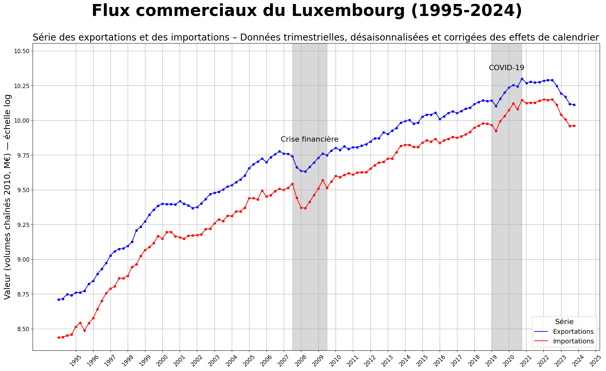
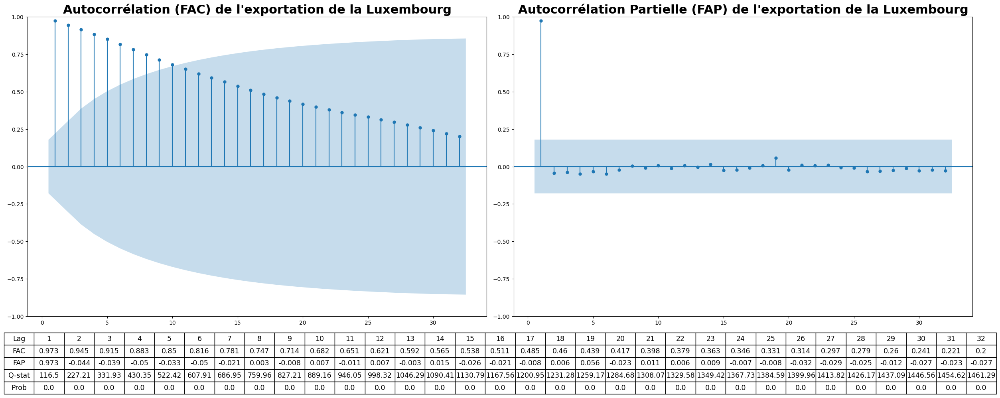
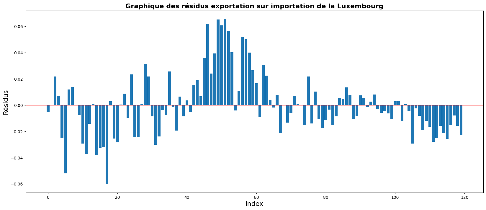
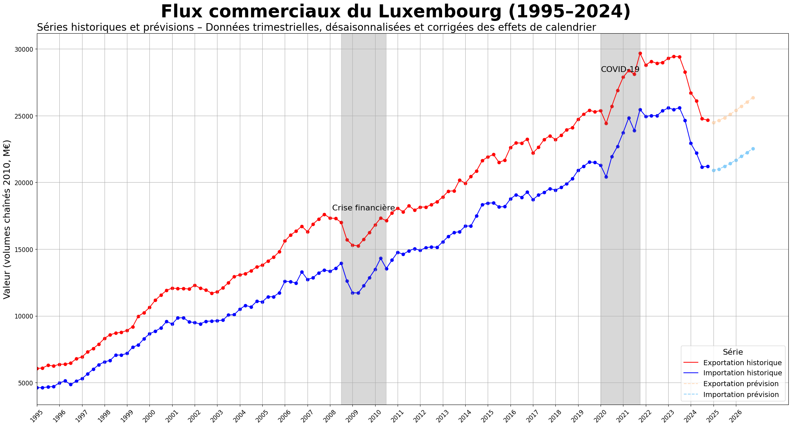

# Analyse des échanges commerciaux du Luxembourg (1995–2024)

Étude économétrique des séries d'**exportations** et d'**importations** du Luxembourg, visant à modéliser leur relation de long terme et à produire des prévisions.

Projet réalisé dans le cadre du Master 1 Économie (EADE), sous la supervision d'Anna Tykhonenko et Thomas Jobert.



## Contexte

Le Luxembourg est l'une des économies les plus ouvertes au monde (taux d'ouverture de 184 % du PIB en 2022), avec un commerce extérieur fortement tourné vers ses voisins (Allemagne, France, Belgique, Pays-Bas). L'objectif de ce projet est de modéliser conjointement ses flux d'exportations et d'importations de biens et services pour :

- comprendre s'ils suivent une dynamique commune depuis 1995,
- tester s'il existe une causalité entre les deux séries,
- produire une prévision de court terme.

## Données

- **Source** : [Eurostat](https://ec.europa.eu/eurostat) (`namq_10_exi`), récupérées directement via l'API Eurostat en Python.
- **Période** : 1995 à 2024, fréquence trimestrielle.
- **Traitement** : volumes chaînés (base 2010, M€), séries désaisonnalisées et corrigées des effets de calendrier, puis transformation logarithmique pour travailler sur un même ordre de grandeur.

## Méthodologie

1. **Analyse univariée** : étude de la stationnarité de chaque série via les corrélogrammes (FAC/FAP), en niveau puis en différence première.
2. **Modèle VAR & causalité de Granger** : un VAR(2) (retard optimal selon le critère BIC) est estimé sur les séries différenciées, puis un test de Fisher/Wald est appliqué pour tester la causalité au sens de Granger entre exportations et importations.
3. **Cointégration (approche Engle-Granger)** : régression MCO des exportations sur les importations (et inversement), puis étude de la stationnarité des résidus pour établir l'existence d'une relation d'équilibre de long terme.
4. **Modèle correcteur d'erreur (VECM)** : estimation d'un VECM(2) intégrant la relation de cointégration, utilisé pour produire les prévisions.




## Résultats clés

- Les deux séries sont **non stationnaires en niveau** mais stationnaires en différence première (bruit blanc sur les corrélogrammes différenciés).
- **Causalité de Granger** : le passé des exportations aide à prévoir les exportations futures (relation positive), et il aide également à prévoir les importations futures. En revanche, le passé des importations ne prédit pas significativement les exportations ; il prédit en revanche négativement les importations futures.
- **Cointégration** : les résidus de la régression exportations/importations sont stationnaires, ce qui confirme l'existence d'une **relation d'équilibre de long terme** entre les deux séries — d'où le passage à un modèle VECM plutôt qu'un simple VAR en différences.
- **VECM(2)** : le coefficient de rappel à l'équilibre (force de correction d'erreur) est plus élevé sur l'équation des exportations, indiquant qu'elles sont plus sensibles que les importations aux déséquilibres passés.



## Limites

- Le modèle suppose que les comportements passés se reproduisent dans le futur et ne peut anticiper de nouveaux chocs exogènes (au-delà de ceux déjà présents dans l'historique, comme la crise financière de 2008 ou la pandémie de 2020).
- Les prévisions restent fiables uniquement à court terme.
- Le modèle ne retient que deux variables : d'autres facteurs (fiscalité, taux d'intérêt, taux de change) influencent également les échanges commerciaux du Luxembourg, dont l'économie repose fortement sur le secteur financier.

## Stack technique

Python · [statsmodels](https://www.statsmodels.org/) (VAR, VECM, tests ADF/Granger) · pandas / numpy · matplotlib / seaborn · [package `eurostat`](https://pypi.org/project/eurostat/) pour la récupération des données.

## Structure du dépôt

```
.
├── notebook/
│   └── analyse-commerce-exterieur-luxembourg.ipynb   # analyse complète, narrative
├── src/
│   └── analyse-commerce-exterieur-luxembourg.py      # équivalent script de l'analyse
├── figure/                                           # graphiques générés — 4 images clés suivies, le reste gitignoré
├── table/                                            # tableaux de résultats générés (FAC/FAP, régressions, VECM...) — gitignoré
├── docs/
│   └── rapport-projet-series-temporelles.pdf          # rapport académique complet
├── requirements.txt
└── README.md
```

## Reproduire l'analyse

```bash
pip install -r requirements.txt
jupyter notebook notebook/analyse-commerce-exterieur-luxembourg.ipynb
# ou, de façon équivalente :
python src/analyse-commerce-exterieur-luxembourg.py
```

L'analyse récupère les données directement depuis l'API Eurostat : aucun fichier de données local n'est nécessaire. Les fichiers générés (Excel, CSV, HTML, graphiques) sont écrits dans `figure/` et `table/`, créés automatiquement.

## Rapport complet

Le [rapport académique](docs/rapport-projet-series-temporelles.pdf) détaille l'intégralité de la démarche, les résultats des tests statistiques et les annexes (modèles, tests de Wald, corrélogrammes, critères d'Akaike et de Schwartz).

---

*Auteur : Marius Calaud*
